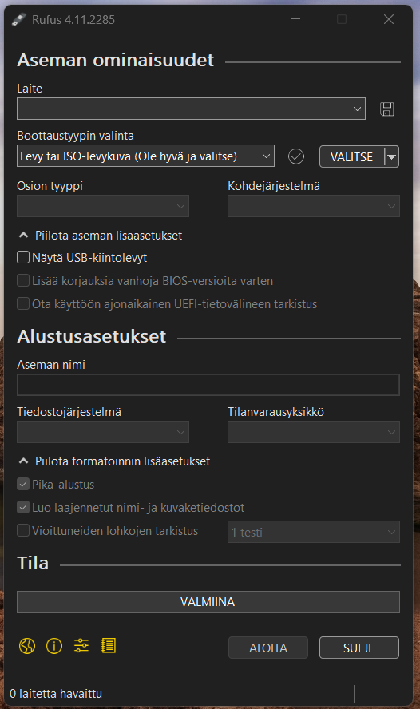
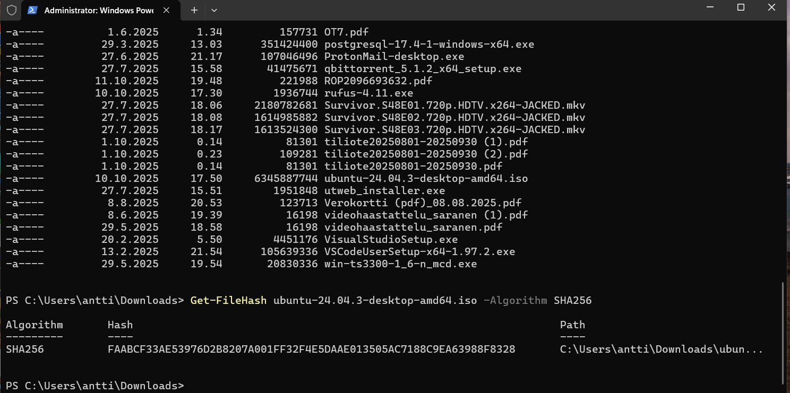
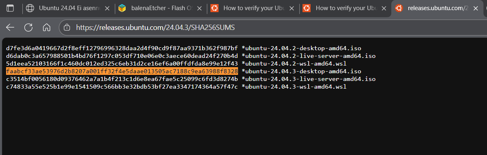
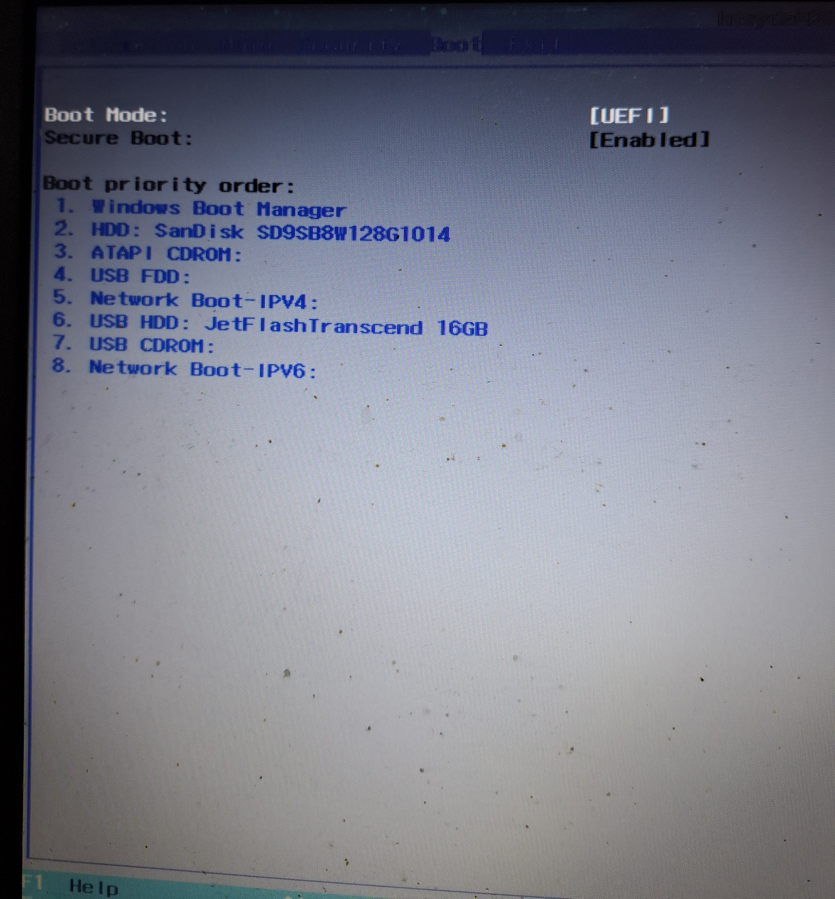
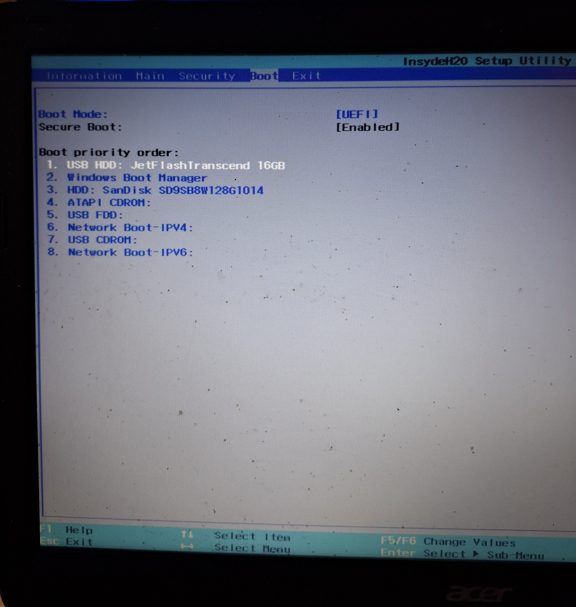
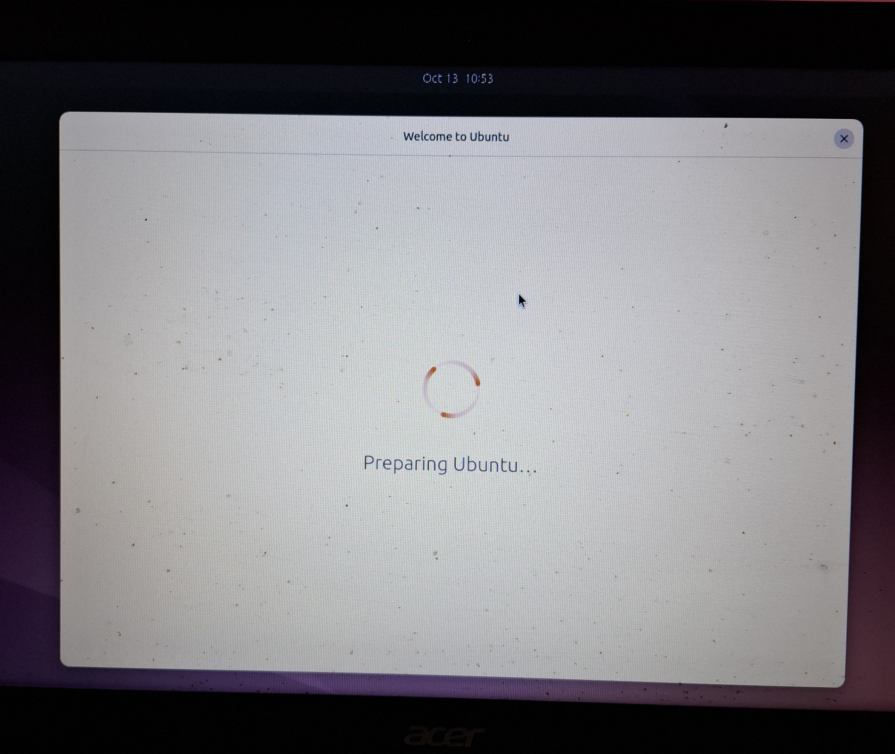
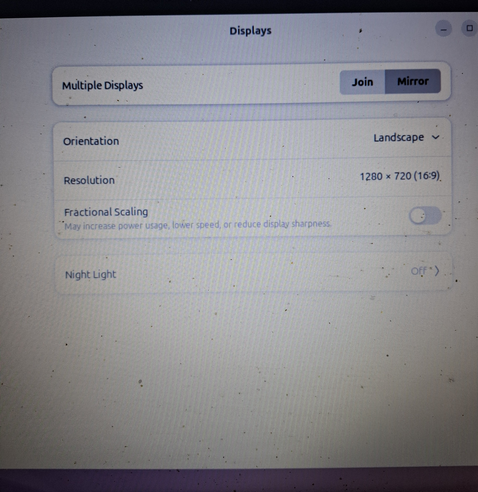
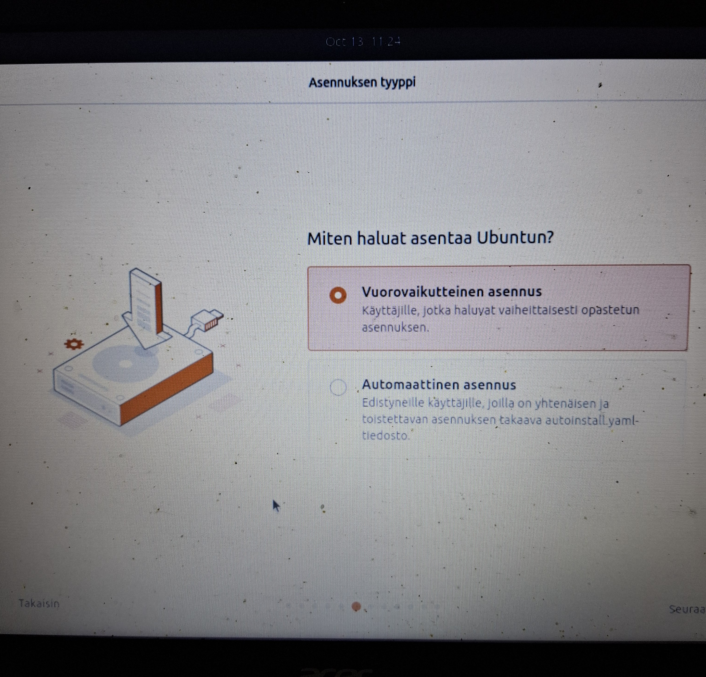
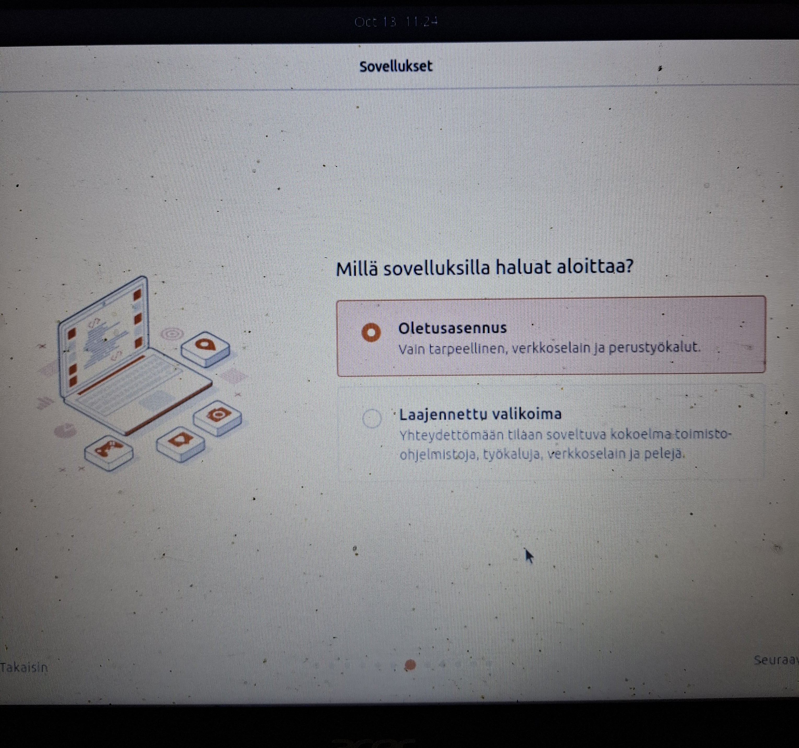
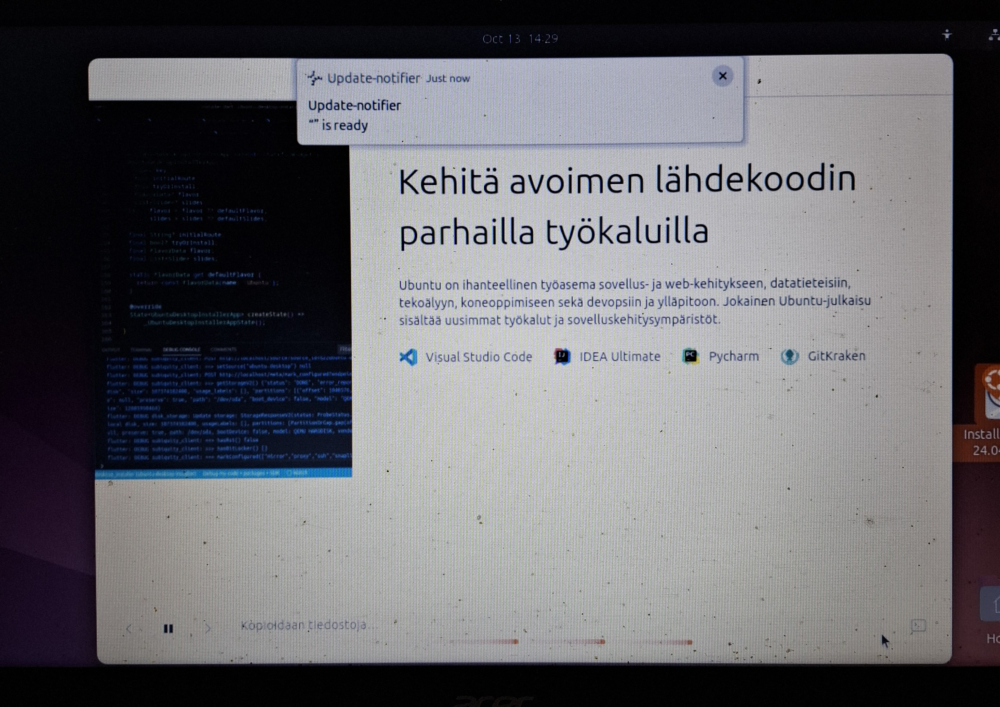

# Linux_asennus
Ubuntun asennus Windows 10-koneelle. Kuvista saa tarkempia tietoja viemällä hiiren kuvakkeen niiden päälle.

Aluksi luodaan asennusmedia. Tässä tapauksessa latasin Ubuntun ISO-tiedoston USB-tikulle käyttämällä
ilmaista Rufus-nimistä sovellusta.

ISO-tiedoston eheyden voi tarkistaa vertaamalla hash-koodia Ubuntun verkkosivuilla löytyvään koodiin.
Jos koodit täsmäävät on tiedosto kunnossa.

Kun asennusmedia on saatu valmiiksi, pitää tietokoneen buuttijärjestystä muuttaa. Tilaan pääsee painamalla
F2-näppäintä koneen käynnistyessä. USB-tikku siirretään listassa ensimmäiseksi. Sen jälkeen painetaan F10
eli tallennus ja lopetus. Tietokone käynnistyy nyt USB-tikun kautta jossa Ubuntu on eikä sen omalta kovalevyltä.

Ubuntun asennus alkaa. Järjestelmä toimii aluksi USB-tikun kautta ennen varsinaista asennusta. Näin
käyttäjä voi testata Ubuntua ennen kuin sen asentaa "pysyvästi" kovalevylle.

Jos käytössä on erillinen näyttö, voi ottaa käyttöön Mirror-tilan. Kuva näkyy silloin erillisen näytön kautta.

Käyttäjä voi valita joko vuorovaikutteisen tai automaattisen asennuksen. Automaattista sovellusta suositellaan
vain kokeneemmille käyttäjille.

